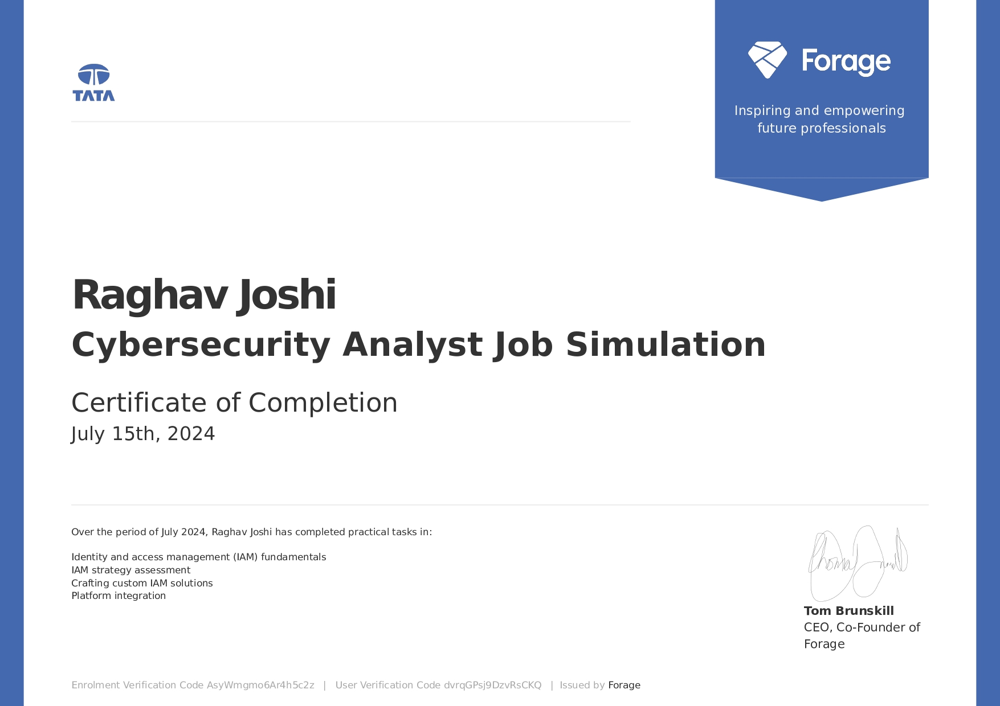

# 🎓 Professional Certifications & Job Simulations

A showcase of my professional development, hands-on project experience, and technical credentials.

---

## ✨ Featured Certifications & Simulations

This section contains detailed breakdowns of my completed programs and credentials, ordered from most recent to oldest.

### Table of Contents
1.  [IBM SkillsBuild - AI Agent Architect](#ibm-skillsbuild---ai-agent-architect)
2.  [J.P. Morgan - Quantitative Research](#jp-morgan---quantitative-research)
3.  [Lloyds Banking Group - Data Science](#lloyds-banking-group---data-science-simulation)
4.  [BCG X - Data Science](#bcg-x---data-science)
5.  [Quantium - Data Analytics](#quantium---data-analytics)
6.  [Deloitte - Data Analytics](#deloitte---data-analytics)
7.  [Tata - GenAI Powered Data Analytics](#tata---genai-powered-data-analytics)
8.  [Data Flair - DSA using C++](#data-flair---introduction-to-dsa-using-c)
9.  [Data Flair - Introduction to Django](#data-flair---introduction-to-django)
10. [Data Flair - Introduction to Deep Learning](#data-flair---introduction-to-deep-learning)
11. [HASHTAG - CODETREK Hackathon](#hashtag---codetrek-hackathon)
12. [Tata - Cybersecurity Analyst](#tata---cybersecurity-analyst)
13. [Tata - Data Visualisation](#tata---data-visualisation)
14. [Data Flair - Introduction to Python](#data-flair---introduction-to-python)

---

### IBM SkillsBuild - AI Agent Architect
* **Organization:** IBM SkillsBuild
* **Issued:** July, 2025
* **Proof:** [View Certificate](ibm%20From%20Learner%20to%20Builder%20Become%20an%20AI%20Agent%20certifate.jpg)
* **Key Skills:** AI Agents, Generative AI, LLMs, System Architecture

View Details

-   Completed a program on designing and building AI agents, focusing on the transition from foundational knowledge to practical application and architectural design.

---

### J.P. Morgan - Quantitative Research
* **Organization:** J.P. Morgan / Forage
* **Issued:** June, 2025
* **Proof:** [View Certificate](forage-jpmorgan-certi.jpg)
* **Key Skills:** Quantitative Analysis, Probability Modeling, Dynamic Programming, Python

View Tasks & Accomplishments

1.  **Analyzed** a diverse loan portfolio to engineer features and estimate a customer's probability of default.
2.  **Applied** dynamic programming techniques to convert FICO scores into categorical data for robust predictive modeling.
3.  **Developed** a quantitative model to assess credit risk and inform future lending strategies.

---

### Lloyds Banking Group - Data Science Simulation
* **Organization:** Lloyds Banking Group / Forage
* **Issued:** June, 2025
* **Proof:** [View Certificate](forage-lloyds-cert.jpg)
* **Key Skills:** Machine Learning, Predictive Modeling, Python (Pandas, Scikit-learn), Hyperparameter Tuning

View Tasks & Accomplishments

1.  **Engineered** a predictive model to identify customer churn, achieving an **ROC-AUC score of 0.82** using a Random Forest classifier.
2.  **Executed** advanced data preprocessing, including handling missing values, encoding categorical variables, and feature scaling.
3.  **Performed** comprehensive model evaluation and hyperparameter tuning with **GridSearchCV** to optimize performance.
4.  **Derived** actionable business insights from **feature importance analysis** to inform customer retention strategies.

---

### BCG X - Data Science
* **Organization:** BCG X / Forage
* **Issued:** June, 2025
* **Proof:** [View Certificate](forage-bcg-cert.jpg)
* **Key Skills:** Data Analysis, Customer Segmentation, Python (Pandas, NumPy), Data Visualization

View Tasks & Accomplishments

1.  **Engineered** and optimized a Random Forest model, achieving a **50% recall rate** in predicting customer churn.
2.  **Conducted** in-depth data analysis and feature engineering using **Pandas** and **NumPy**.
3.  **Developed** insightful data visualizations to interpret trends and present findings effectively.
4.  **Authored** a concise executive summary, translating complex analytical results into actionable recommendations.

---

### Quantium - Data Analytics
* **Organization:** Quantium / Forage
* **Issued:** June, 2025
* **Proof:** [View Certificate](forage-quantinum-cert.jpg)
* **Key Skills:** Commercial Analytics, Customer Segmentation, A/B Testing, Data-driven Strategy

View Tasks & Accomplishments

1.  **Analyzed** large-scale transaction datasets to prepare data and derive customer insights.
2.  **Identified** and validated benchmark stores to measure performance and conduct uplift testing.
3.  **Synthesized** analytical findings into comprehensive reports for category managers.

---

### Deloitte - Data Analytics
* **Organization:** Deloitte Australia / Forage
* **Issued:** June, 2025
* **Proof:** [View Certificate](forage-deill-certi.jpg)
* **Key Skills:** Data Dashboards, Data Classification, Forensic Technology, Tableau, Excel

View Tasks & Accomplishments

1.  **Investigated** business scenarios using data analysis and forensic technology principles.
2.  **Designed** and built an interactive data dashboard using **Tableau** to visualize key metrics.
3.  **Leveraged** advanced Excel functions for data classification and business conclusions.

---

### Tata - GenAI Powered Data Analytics
* **Organization:** Tata / Forage
* **Issued:** June, 2025
* **Proof:** [View Certificate](forage-tga-certi.jpg)
* **Key Skills:** Generative AI, EDA, Predictive Modeling, AI Strategy, Ethical AI

View Tasks & Accomplishments

1.  **Utilized** GenAI tools for exploratory data analysis (EDA) to assess data quality and identify risk indicators.
2.  **Proposed** a no-code predictive modeling framework to assess customer delinquency risk.
3.  **Designed** an AI-driven collections strategy incorporating agentic AI, automation, and ethical AI principles.

---

### Data Flair - Introduction to DSA using C++
* **Organization:** Data Flair
* **Issued:** April, 2025
* **Proof:** [View Certificate](Introduction-to-DSA-using-C.jpg)
* **Key Skills:** Data Structures, Algorithms, C++, Problem Solving

View Details

-   Completed a foundational course in Data Structures and Algorithms, focusing on implementation and problem-solving using C++.

---

### Data Flair - Introduction to Django
* **Organization:** Data Flair
* **Issued:** February, 2025
* **Proof:** [View Certificate](Introduction-to-Django.jpg)
* **Key Skills:** Django, Web Development, Python, MVC Architecture

View Details

-   Gained foundational knowledge of the Django framework for building robust and scalable web applications with Python.

---

### Data Flair - Introduction to Deep Learning
* **Organization:** Data Flair
* **Issued:** January, 2025
* **Proof:** [View Certificate](Deep%20Learning.jpg)
* **Key Skills:** Deep Learning, Neural Networks, AI Fundamentals

View Details

-   Covered the fundamental concepts of Deep Learning, including neural network architecture, activation functions, and training processes.

---

### HASHTAG - CODETREK Hackathon
* **Organization:** HASHTAG Society of JEMTEC
* **Issued:** January, 2025
* **Proof:** [View Certificate](hashtag.jpg)
* **Key Skills:** Competitive Programming, Team Collaboration, Problem Solving

View Details

-   Participated in the Codetreck hackathon, developing solutions to complex problems within a competitive, time-constrained environment.

---

### Google Developer Student Clubs - Python and Artificial Intelligence
* **Organization:** Google Developer Student Clubs/DevTown
* **Issued:** August, 2024
* **Proof:** [View Certificate](Py&Ai.jpg)
* **Key Skills:** AI Agents, Generative AI, LLMs, System Architecture

---

### Tata - Cybersecurity Analyst
* **Organization:** Tata / Forage
* **Issued:** July, 2024
* **Proof:** [View Certificate](forage-tac-certi.jpg)
* **Key Skills:** IAM, Cybersecurity Consulting, Stakeholder Communication

View Tasks & Accomplishments

1.  **Applied** core Identity and Access Management (IAM) principles within a cybersecurity consulting context.
2.  **Aligned** technical security solutions with strategic business objectives.
3.  **Delivered** comprehensive documentation to communicate complex technical concepts.

---

### Tata - Data Visualisation
* **Organization:** Tata / Forage
* **Issued:** July, 2024
* **Proof:** [View Certificate](forage-tdv-certi.jpg)
* **Key Skills:** Data Visualization, Stakeholder Engagement, Dashboard Design

View Tasks & Accomplishments

1.  **Translated** business requirements into clear, targeted questions for senior leadership.
2.  **Designed** and created compelling data visualizations to reveal trends and patterns.
3.  **Built** visuals to empower executive decision-making with actionable, data-driven insights.

---

### DevTown - Bootcamp on Cloud Computing and DevOps A to Z
* **Organization:** DevTown
* **Issued:** July, 2024
* **Proof:** [View Certificate](cloudcom.jpg)
* **Key Skills:** AI Agents, Generative AI, LLMs, System Architecture

---

### Google Developer Student Clubs - Cloud Computing and Devops A to Z
* **Organization:** Google Developer Student Clubs/DevTown
* **Issued:** July, 2024
* **Proof:** [View Certificate](cloud%20comp%20google.jpg)
* **Key Skills:** AI Agents, Generative AI, LLMs, System Architecture

---

### Data Flair - Introduction to Python
* **Organization:** Data Flair
* **Issued:** April, 2024
* **Proof:** [View Certificate](Introduction-to-Python-Certificate.jpg)
* **Key Skills:** Python, Programming Fundamentals, Data Types

View Details

-   Mastered the fundamentals of Python programming, including syntax, data structures, and control flow for building applications.

---

## 📚 All Certifications (Tabular View)

| Certificate / Simulation | Issuing Organization | Date Issued |
| :--- | :--- | :--- |
| **AI Agent Architect** | IBM SkillsBuild | July, 2025 |
| **Quantitative Research** | J.P. Morgan / Forage | June, 2025 |
| **Data Science Simulation** | Lloyds Banking Group / Forage | June, 2025 |
| **Data Science Simulation** | BCG X / Forage | June, 2025 |
| **Data Analytics Simulation** | Quantium / Forage | June, 2025 |
| **Data Analytics Simulation** | Deloitte / Forage | June, 2025 |
| **GenAI Powered Data Analytics** | Tata / Forage | June, 2025 |
| **Introduction to DSA using C++** | Data Flair | April, 2025 |
| **Introduction to Django** | Data Flair | February, 2025 |
| **Introduction to Deep Learning** | Data Flair | January, 2025 |
| **CODETREK Hackathon** | HASHTAG Society | January, 2025 |
| **Cybersecurity Analyst** | Tata / Forage | July, 2024 |
| **Data Visualisation** | Tata / Forage | July, 2024 |
| **Introduction to Python** | Data Flair | April, 2024 |

