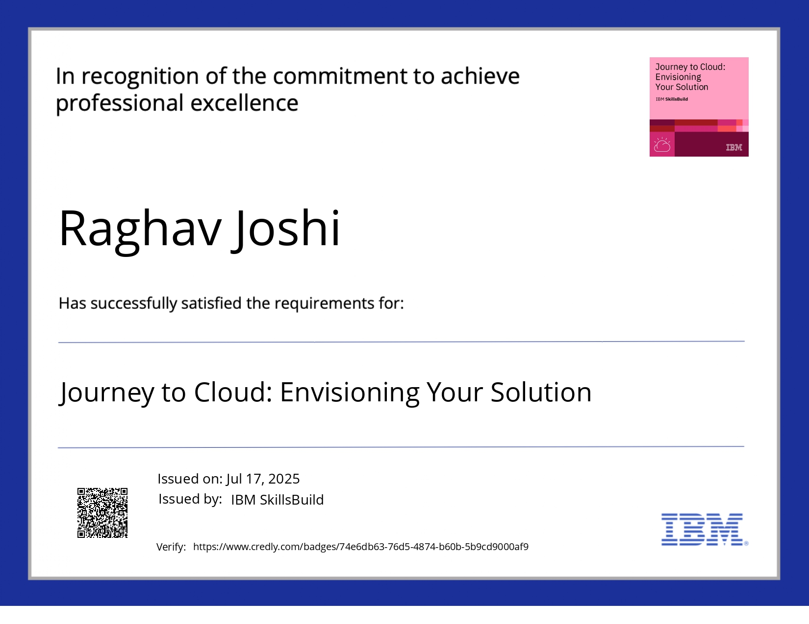
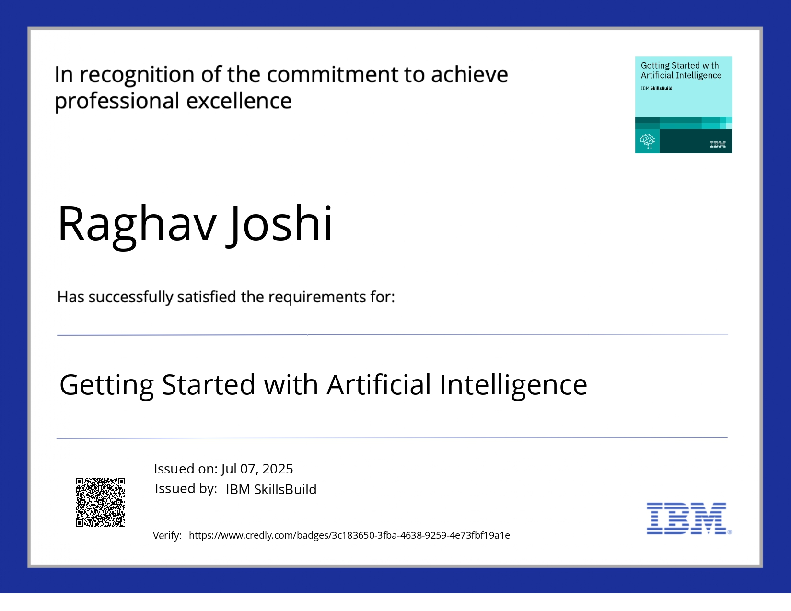

# 🎓 Professional Certifications & Job Simulations

A showcase of my professional development, hands-on project experience, and technical credentials.

---

## ✨ Featured Certifications & Simulations

This section contains detailed breakdowns of my completed programs and credentials, ordered from most recent to oldest.

### Table of Contents

1. [IBM SkillsBuild - AI Agent Architect](#ibm-skillsbuild---ai-agent-architect)
2. [J.P. Morgan - Quantitative Research](#jp-morgan---quantitative-research)
3. [Lloyds Banking Group - Data Science](#lloyds-banking-group---data-science-simulation)
4. [BCG X - Data Science](#bcg-x---data-science)
5. [Quantium - Data Analytics](#quantium---data-analytics)
6. [Deloitte - Data Analytics](#deloitte---data-analytics)
7. [Tata - GenAI Powered Data Analytics](#tata---genai-powered-data-analytics)
8. [Data Flair - DSA using C++](#data-flair---introduction-to-dsa-using-c)
9. [Data Flair - Introduction to Django](#data-flair---introduction-to-django)
10. [Data Flair - Introduction to Deep Learning](#data-flair---introduction-to-deep-learning)
11. [HASHTAG - CODETREK Hackathon](#hashtag---codetrek-hackathon)
12. [GDSC - Python and AI](#google-developer-student-clubs---python-and-artificial-intelligence)
13. [Microsoft Learn Student Ambassador](#microsoft-learn-student-ambassador)
14. [AWS Community Builders - Python and AI](#aws-community-builders---python-and-ai)
15. [DevTown - Certificate of Appreciation](#devtown---certificate-of-appreciation)
16. [Tata - Cybersecurity Analyst](#tata---cybersecurity-analyst)
17. [Tata - Data Visualisation](#tata---data-visualisation)
18. [DevTown - Python and AI](#devtown---python-and-artificial-intelligence)
19. [GDSC - Cloud Computing & DevOps](#google-developer-student-clubs---cloud-computing-and-devops-a-to-z)
20. [DevTown - Cloud Computing & DevOps](#devtown---bootcamp-on-cloud-computing-and-devops-a-to-z)
21. [Data Flair - Introduction to Python](#data-flair---introduction-to-python)

---

### IBM SkillsBuild - Journey to Cloud: Envisioning Your Solution
* **Organization:** IBM SkillsBuild
* **Issued:** July, 2025
* **Proof:** [View Certificate](Journey_to_Cloudcredly.jpg)

---

### IBM SkillsBuild - Lab: Retrieval Augmented Generation with LangChain
* **Organization:** IBM SkillsBuild
* **Issued:** July, 2025
* **Proof:** [View Certificate](certificate_lab_retrevial_page.jpg)

---

### IBM SkillsBuild - AI Agent Architect
* **Organization:** IBM SkillsBuild
* **Issued:** July, 2025
* **Proof:** [View Certificate](ibm%20From%20Learner%20to%20Builder%20Become%20an%20AI%20Agent%20certifate.jpg)
* **Key Skills:** AI Agents, Generative AI, LLMs, System Architecture

  
View Details

  - Completed a program on designing and building AI agents, focusing on the transition from foundational knowledge to practical application and architectural design.

---

### IBM SkillsBuild - Getting Started with Artificial Intelligence
* **Organization:** IBM SkillsBuild
* **Issued:** July, 2025
* **Proof:** [View Certificate](getting_started_ai_credly_page-0001.jpg)

---

### J.P. Morgan - Quantitative Research
* **Organization:** J.P. Morgan / Forage
* **Issued:** June, 2025
* **Proof:** [View Certificate](forage-jpmorgan-certi.jpg)
* **Key Skills:** Quantitative Analysis, Probability Modeling, Dynamic Programming, Python

  
View Tasks & Accomplishments

  1. **Analyzed** a diverse loan portfolio to engineer features and estimate a customer's probability of default.
  2. **Applied** dynamic programming techniques to convert FICO scores into categorical data for robust predictive modeling.
  3. **Developed** a quantitative model to assess credit risk and inform future lending strategies.

---

### Lloyds Banking Group - Data Science Simulation
* **Organization:** Lloyds Banking Group / Forage
* **Issued:** June, 2025
* **Proof:** [View Certificate](forage-lloyds-cert.jpg)
* **Key Skills:** Machine Learning, Predictive Modeling, Python (Pandas, Scikit-learn), Hyperparameter Tuning

  
View Tasks & Accomplishments

  1. **Engineered** a predictive model to identify customer churn, achieving an **ROC-AUC score of 0.82** using a Random Forest classifier.
  2. **Executed** advanced data preprocessing, including handling missing values, encoding categorical variables, and feature scaling.
  3. **Performed** comprehensive model evaluation and hyperparameter tuning with **GridSearchCV** to optimize performance.
  4. **Derived** actionable business insights from **feature importance analysis** to inform customer retention strategies.

---

### BCG X - Data Science
* **Organization:** BCG X / Forage
* **Issued:** June, 2025
* **Proof:** [View Certificate](forage-bcg-cert.jpg)
* **Key Skills:** Data Analysis, Customer Segmentation, Python (Pandas, NumPy), Data Visualization

  
View Tasks & Accomplishments

  1. **Engineered** and optimized a Random Forest model, achieving a **50% recall rate** in predicting customer churn.
  2. **Conducted** in-depth data analysis and feature engineering using **Pandas** and **NumPy**.
  3. **Developed** insightful data visualizations to interpret trends and present findings effectively.
  4. **Authored** a concise executive summary, translating complex analytical results into actionable recommendations.

---

### Quantium - Data Analytics
* **Organization:** Quantium / Forage
* **Issued:** June, 2025
* **Proof:** [View Certificate](forage-quantinum-cert.jpg)
* **Key Skills:** Commercial Analytics, Customer Segmentation, A/B Testing, Data-driven Strategy

  
View Tasks & Accomplishments

  1. **Analyzed** large-scale transaction datasets to prepare data and derive customer insights.
  2. **Identified** and validated benchmark stores to measure performance and conduct uplift testing.
  3. **Synthesized** analytical findings into comprehensive reports for category managers.

---

### Deloitte - Data Analytics
* **Organization:** Deloitte Australia / Forage
* **Issued:** June, 2025
* **Proof:** [View Certificate](forage-deill-certi.jpg)
* **Key Skills:** Data Dashboards, Data Classification, Forensic Technology, Tableau, Excel

  
View Tasks & Accomplishments

  1. **Investigated** business scenarios using data analysis and forensic technology principles.
  2. **Designed** and built an interactive data dashboard using **Tableau** to visualize key metrics.
  3. **Leveraged** advanced Excel functions for data classification and business conclusions.

<a href="forage-deill-certi.jpg">
  <img src="forage-de
